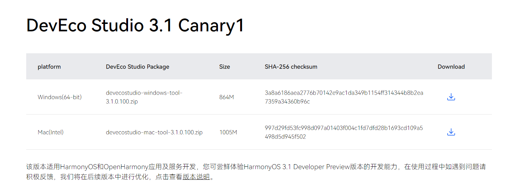
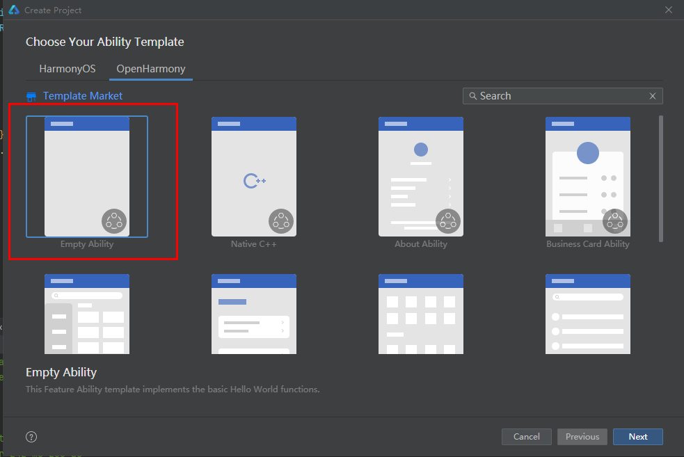
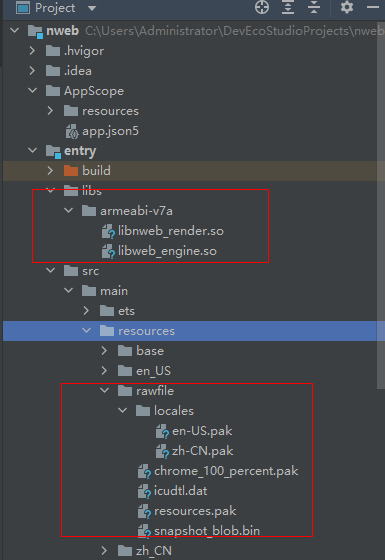
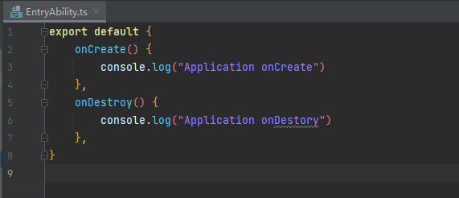

# chromium
- [简介](#简介)
- [目录](#目录)
- [使用说明](#使用说明)
- [相关仓](#相关仓)
## 简介
### 内容介绍
1. Chromium是由Google主导开发的网页浏览器，以BSD许可证等多重自由版权发行并开放源代码，是Google的Chrome浏览器背后的引擎，其目的是为了创建一个安全、稳定和快速的通用浏览器。
2. OpenHarmony nwebview基于Chromium构建。
### 软件架构
软件架构说明
```
    -----------------------
    |      web组件          |
    -----------------------
    |      nwebview        |
    -----------------------
    |       CEF            |
    -----------------------
    |      Chromium        |
    -----------------------
    |  OpenHarmony基础库    |
    -----------------------
```
* web组件：OpenHarmony的UI组件。
* nwebview：基于CEF构建的OpenHarmony web组件的Native引擎。
* CEF：CEF全称Chromium Embedded Framework，是一个基于Google Chromium 的开源项目。
* Chromium： Chromium是一个由Google主导开发的网页浏览器，以BSD许可证等多重自由版权发行并开放源代码。
## 目录
```
.
└── patch                      # 构建nwebview，针对chromium修改的patch目录
```
## 使用说明
1. 执行./init_chromium.sh，初始化源代码，主要做以下几步
* 下载google工具集depot_tools。
* 拉取chromium源码，下载chromium依赖的相关三方库
* 在源代码基础上增加针对nweb的构建修改，主要包括：增加cef代码，openharmony编译构建适配，nweb构建源码，chromium漏洞补丁以及nweb的bugfix修改。
*注1：关于cef的介绍，可以访问cef仓：[third_party_cef](https://gitee.com/openharmony/third_party_cef)*
2. 全量编译RK3568平台openharmony镜像，成功后，再执行第三步编译基于openharmony平台的nweb组件。
*注2：关于如何构建RK3568平台openharmony镜像，可以访问：[RK3568编译指导](https://gitee.com/openharmony/docs/blob/master/zh-cn/device-dev/quick-start/quickstart-ide-3568-build.md)*
3. 执行./build.sh rk3568，编译源码。
4. 通过DevEco studio将编译目标打包成NWeb.hap，使用hdc_std install NWeb.hap安装至RK3568，
* 1.IDE下载可访问：[下载官网](https://developer.harmonyos.com/cn/develop/deveco-studio#download)
   

* 2.新建OpenHarmony空白工程
   
* 3.复制编译生成的文件（src/out/rk3568或src/out/rk3568_64目录下）至工程对应位置
    32位镜像，so放置于/entry/libs/armeabi-v7a/
    64位镜像，so放置于/entry/libs/arm64-v8a/
    其他资源文件放置于/entry/src/main/resources/rawfile/
    如图所示为32位镜像对应放置位置：
    

* 4.删除entry/src/main/ets/pages/Index.ets文件

* 5.修改src/main/ets/entryability/EntryAbility.ts文件为以下内容：
    

* 6.修改src/main/module.json5文件，删除"abilities"字段

* 7.删除src/main/resources/base/media/icon.png

* 8.修改AppScope/app.json5中"vendor"的值为"nweb",

* 9.删除src/main/resources/base/profile/main_pages.json中”src”中的内容

* 10.配置自动签名之后，通过IDE打包hap

* 11.由于签名不同，无法直接安装，通过
  hdc file send 本地hap包 /system/app/com.ohos.nweb/NWeb.hap
进行安装

## 相关仓
[arkui_ace_engine](https://gitee.com/openharmony/arkui_ace_engine)

[third_party_cef](https://gitee.com/openharmony/third_party_cef)

[web_webview](https://gitee.com/openharmony/web_webview)

**[third_party_chromium](https://gitee.com/openharmony/third_party_chromium)**
